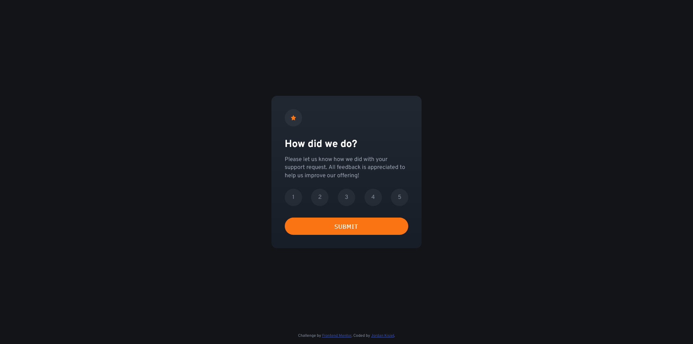

# Frontend Mentor - Interactive rating component solution

This is a solution to the [Interactive rating component challenge on Frontend Mentor](https://www.frontendmentor.io/challenges/interactive-rating-component-koxpeBUmI). Frontend Mentor challenges help you improve your coding skills by building realistic projects. 

## Table of contents

- [Overview](#overview)
  - [The challenge](#the-challenge)
  - [Screenshot](#screenshot)
  - [Links](#links)
- [My process](#my-process)
  - [Built with](#built-with)
  - [What I learned](#what-i-learned)
  - [Continued development](#continued-development)
- [Author](#author)

## Overview

### The challenge

Users should be able to:

- View the optimal layout for the app depending on their device's screen size
- See hover states for all interactive elements on the page
- Select and submit a number rating
- See the "Thank you" card state after submitting a rating

### Screenshot

### Links

- Live Site URL: (https://jordankisiel.github.io/interactive-rating-component-main/)

## My process

### Built with

- Semantic HTML5 markup
- CSS custom properties
- Flexbox
- CSS Grid
- Mobile-first workflow
- Vanilla JS

### What I learned
Applied and reinforced what I learned from javascript tutorials for the first time. 

### Continued development
While I was able to add some animation to the transition between the rating display and 'thank you' display, I wasn't able to create exactly what I wanted. Therefore, I'd like to learn more about adding animations and how to use them with javascript.

As for HTML/CSS, I'd like to try a more complex design.

## Author

- Website - [Jordan Kisiel](https://robojojo.co/)
- Frontend Mentor - [@JordanKisiel](https://www.frontendmentor.io/profile/JordanKisiel)
- Twitter - [@JordanKisiel](https://www.twitter.com/JordanKisiel)
